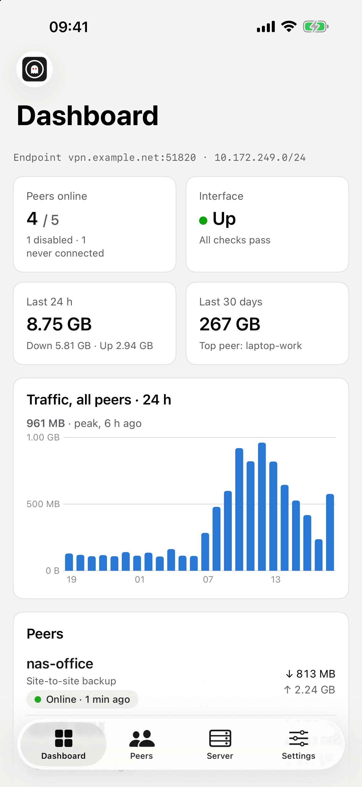
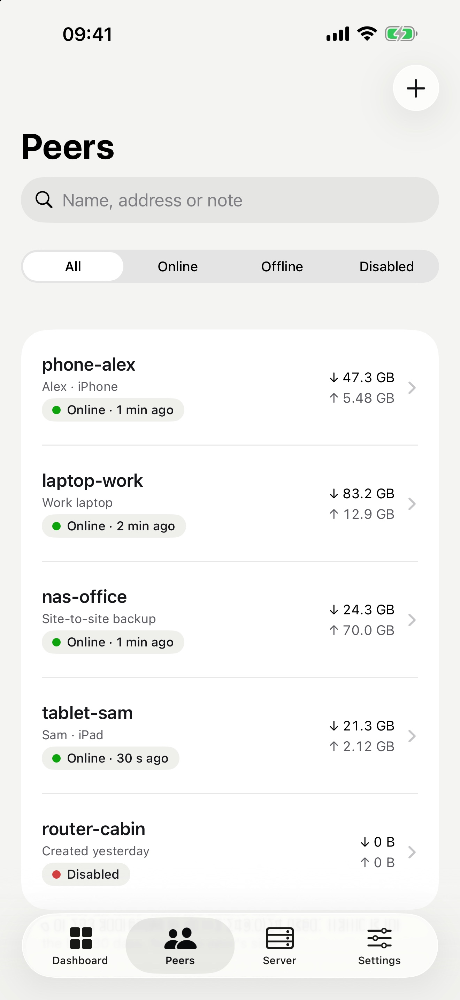
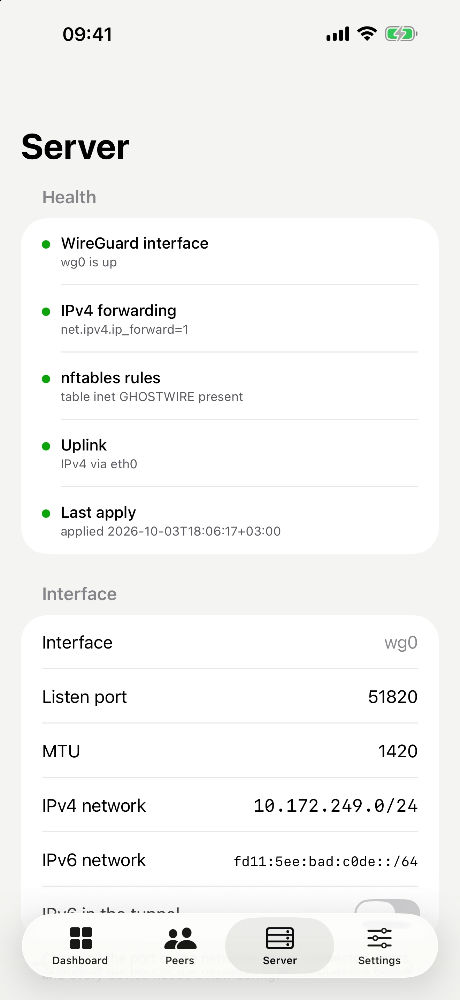

# GHOSTWIRE Companion

The iPhone app for [GHOSTWIRE](https://github.com/danielredetzke/GHOSTWIRE),
the self-hosted WireGuard server manager. It talks to your GHOSTWIRE server's
JSON API with an API token: no cloud service, no account, no tracking.

The app is currently in beta testing. For an invite, email
[engineroom@redetzke.aero](mailto:engineroom@redetzke.aero).

<p>
  
  
  
</p>

## Features

- **Dashboard:** whether this iPhone is behind the VPN, peers online, traffic
  over 24 hours, 7 and 30 days, the server's status and uptime, and a notice
  when a new GHOSTWIRE release is out.
- **Live:** the speed of every peer right now, updated every 2 seconds.
- **Peers:** search, filter and sort; add, edit, disable and delete peers. A new config is shown once,
  as a QR code for the WireGuard app or as a setup link. Issuing a new config
  rotates the peer's keys, so the old one stops working.
- **Per peer:** traffic over 24 hours, 7 and 30 days, latency through the
  tunnel and connection history.
- **Server:** health checks, the public addresses, port, networks, endpoint,
  firewall options and client defaults; rotate the server key.
- **Settings:** web interface, log level and data retention, the log viewer,
  and restarting the service.
- **Several servers:** pair as many servers as you like and switch between
  them from the server name at the top of every tab. The list shows whether
  each server is reachable, how many peers are online, and which server this
  iPhone's traffic goes out through.

Users, passwords, API tokens, two-step sign-in, backup and restore are managed
in the web interface only.

## Pairing

In the GHOSTWIRE web interface, open Settings → Pair iOS app, choose full
access or read only, and scan the QR code with the app. Without a camera, tap
"Copy pairing code" there and paste it into the app's "Enter manually".

The pairing code holds the server address, the API token and, for a
self-signed certificate, its SHA-256 fingerprint. The app accepts the server
only if its certificate matches that fingerprint; Let's Encrypt certificates
are checked normally. Pairings are stored in the iOS keychain on this device
only. To add another server, tap the server name at the top of any tab, then
Add server. Pairing a server again replaces its token. Settings → Remove this
server deletes its pairing; revoke the token in the web interface too. If a
server revokes the token, the app offers to pair that server again or remove
it; your other servers keep working.

Keep the app up to date when you update the server: the app follows the
server's API, and an older app build may not work with a newer server.

## Requirements

- iPhone with iOS 17 or later
- A GHOSTWIRE server reachable from the phone
- To build: Xcode with Swift 6

## Building

Open `GHOSTWIRE.xcodeproj` in Xcode, choose your team under Signing &
Capabilities, and run the `GHOSTWIRE` scheme on a device or simulator.

From the command line:

```sh
xcodebuild -scheme GHOSTWIRE -destination 'generic/platform=iOS Simulator' build
```

## Project layout

All sources are in `GHOSTWIRE/`, one SwiftUI target with default main-actor
isolation:

| File | What |
|---|---|
| `GhostwireApp.swift` | app entry, tabs |
| `API.swift`, `Session.swift` | API client, certificate pinning, keychain |
| `Models.swift` | types that mirror the server's JSON |
| `DashboardView.swift`, `TrafficChart.swift` | dashboard and charts |
| `PeersView.swift`, `PeerDetailView.swift`, `PeerForms.swift`, `Latency.swift` | peers |
| `IssuedConfigView.swift`, `SetupLinkViews.swift` | showing a new config or setup link |
| `ServerView.swift`, `HealthView.swift` | server settings and health |
| `SettingsView.swift` | app settings and the log |
| `PairingView.swift` | QR and manual pairing |
| `Theme.swift`, `Logo.swift`, `Format.swift` | colors, fonts, logo, formatting |

`AppStore/` holds the App Store listing text (`metadata.md`) and the
screenshots.

## License

MIT, see `LICENSE`. The wordmark font, Shippori Mincho B1, is bundled under
the SIL Open Font License; see `OFL-ShipporiMincho.txt`.

WireGuard is a registered trademark of Jason A. Donenfeld. GHOSTWIRE is not
affiliated with or endorsed by the WireGuard project.
